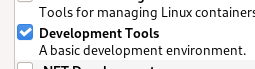
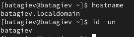
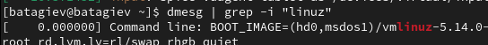
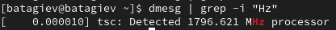
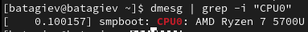
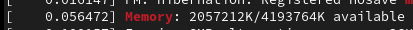
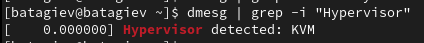
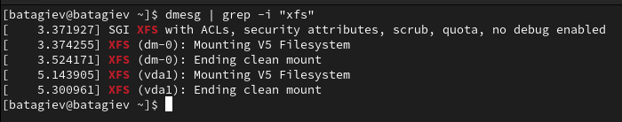

---
## Front matter
title: "Лабораторная работа No 1."
author: "Тагиев Байрам Алтай оглы"

## Generic otions
lang: ru-RU
toc-title: "Содержание"

## Bibliography
bibliography: bib/cite.bib
csl: pandoc/csl/gost-r-7-0-5-2008-numeric.csl

## Pdf output format
toc: true # Table of contents
toc-depth: 2
lof: true # List of figures
lot: true # List of tables
fontsize: 12pt
linestretch: 1.5
papersize: a4
documentclass: scrreprt
## I18n polyglossia
polyglossia-lang:
  name: russian
  options:
	- spelling=modern
	- babelshorthands=true
polyglossia-otherlangs:
  name: english
## I18n babel
babel-lang: russian
babel-otherlangs: english
## Fonts
mainfont: PT Serif
romanfont: PT Serif
sansfont: PT Sans
monofont: PT Mono
mainfontoptions: Ligatures=TeX
romanfontoptions: Ligatures=TeX
sansfontoptions: Ligatures=TeX,Scale=MatchLowercase
monofontoptions: Scale=MatchLowercase,Scale=0.9
## Biblatex
biblatex: true
biblio-style: "gost-numeric"
biblatexoptions:
  - parentracker=true
  - backend=biber
  - hyperref=auto
  - language=auto
  - autolang=other*
  - citestyle=gost-numeric
## Pandoc-crossref LaTeX customization
figureTitle: "Рис."
tableTitle: "Таблица"
listingTitle: "Листинг"
lofTitle: "Список иллюстраций"
lotTitle: "Список таблиц"
lolTitle: "Листинги"
## Misc options
indent: true
header-includes:
  - \usepackage{indentfirst}
  - \usepackage{float} # keep figures where there are in the text
  - \floatplacement{figure}{H} # keep figures where there are in the text
---

# Цель работы

Целью данной работы является приобретение практических навыков установки операционной системы на виртуальную машину, настройки минимально необходимых для дальнейшей работы сервисов.

## Предварительные комментарии

Многие скриншоты не вставлены, так не имеют явного значения, а лишь повторяют изложенный далее материал.

# Выполнение лабораторной работы

## Подготовка виртуальной машины к установке

1. Создадим виртуальную машину, в нее добавим 2 ядра, 4 гига. (к сожалению, без
   игровой видеокарты).

2. Добавим в нее раздел на 20 ГБ памяти, а также подключим iso образ инсталятора Rocky Linux.

3. Запустим и перейдем к установке.

## Установка Rocky Linux

1. Выбираем язык English и язык English (United States).

2. Выбираем автоматическую разметку диска.

3. Добавляем нового пользователя, учитывая соглашение об именовании (@fig:001).

{#fig:001 width=70%}

4. В предустанавливаемом ПО выбираем базовое окружение "Сервер с GUI" и группу "Developments tool".

{#fig:002 width=70%}

5. Отключаем kdump.

6. Выставляем пароль для рута.

7. Задаем hostname.

8. Запускаем установку.

9. Проверяем правильность установленного hostname и username (согласно соглашению об именовании).

{#fig:003 width=70%}

## Домашнее задание

{#fig:061 width=70%}

{#fig:062 width=70%}

{#fig:063 width=70%}

{#fig:064 width=70%}

{#fig:065 width=70%}

{#fig:066 width=70%}

# Выводы

По итогам выполнения работы, я настроил виртуальную машину с Rocky Linux.
