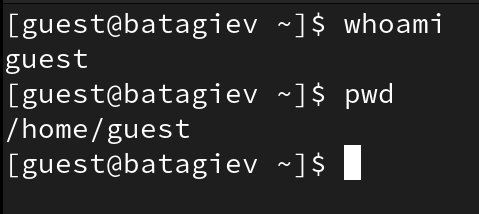
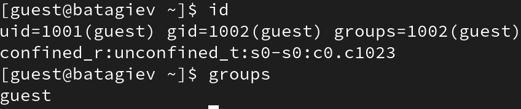
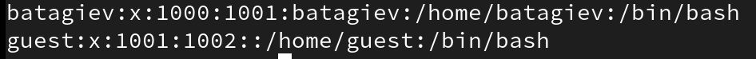
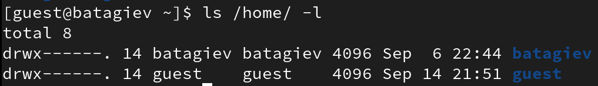
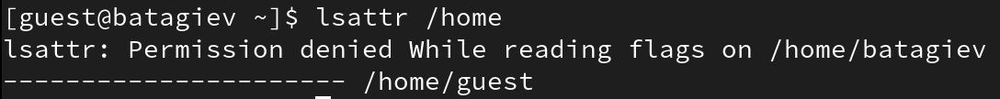
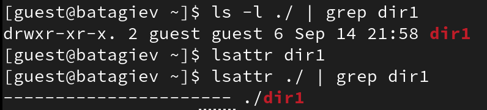
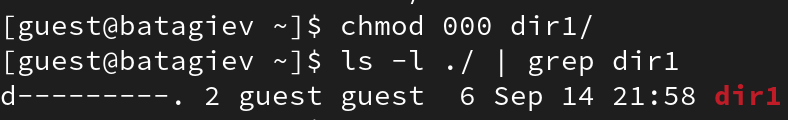
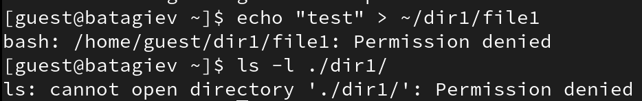
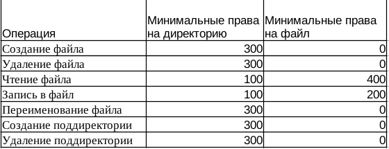

---
## Front matter
lang: ru-RU
title: Лабораторная работа No 2.
author:
  - Тагиев Б. А.
institute:
  - Российский университет дружбы народов, Москва, Россия
date: 15 сентября 2023

## i18n babel
babel-lang: russian
babel-otherlangs: english

## Formatting pdf
toc: false
toc-title: Содержание
slide_level: 2
aspectratio: 169
theme: metropolis
section-titles: true
header-includes:
 - \metroset{progressbar=frametitle,sectionpage=progressbar,numbering=fraction}
 - '\makeatletter'
 - '\beamer@ignorenonframefalse'
 - '\makeatother'
---

## Цель работы

Получение практических навыков работы в консоли с атрибутами файлов, закрепление теоретических основ дискреционного разграничения доступа в современных системах с открытым кодом на базе ОС Linux

## Выполнение лабораторной работы

1. Создать пользователя guest. При помощи команды 

```
yes 1 | adduser guest
```

2. Задать новому пользователю пароль, при помощи утилиты passwd.

3. Войти в новую сессию под пользователем guest.

## Выполнение лабораторной работы

4. Открыть терминал и посмотреть в какой мы директории. Для этого будет использовать pwd (print workdir). Вывод команды можно увидеть на картинке. Данная директория является домашней для пользователя guest.

{#fig:001 width=50%}

## Выполнение лабораторной работы

5. Для того, чтобы узнать username пользоваться, воспользуемся командой whoami.

{#fig:001 width=50%}

## Выполнение лабораторной работы

6. Посмотрим на вывод команды id. Там мы видим UID, GID и дополнительные метки пользователя. Вывод информации о группах сопоставим с тем, что мы увидем, при запуске команды groups.

{#fig:002}

## Выполнение лабораторной работы

7. Пользователь guest и в приглашение командной строки имеет в себе username guest.

8. В файле `/etc/passwd` лежит информация о всех пользователях системы. UID = 1001, GUID=1002.

{#fig:003 width=50%}

## Выполнение лабораторной работы

9. В директории `/home/` у нас находятся все папки для каждого пользователя системы (кроме системных пользователей). На обоих папках права выставлены 700.

{#fig:004 width=50%}

## Выполнение лабораторной работы

10. Расширенные атрибуты удастся посмотреть только для директорий, до которых может достучаться пользователь. Потому там и появилась ошибка доступа.

{#fig:005}

## Выполнение лабораторной работы

11. Создадим директорию `dir1` в домашнем каталоге. Посмотрим на ее права и атрибуты. На dir1 выставлены права 755.

{#fig:006 width=50%}

## Выполнение лабораторной работы

12. Обнулим права доступа, при помощи chmod.

{#fig:007}

## Выполнение лабораторной работы

13. При попытке создать файл --- получаем ошибку доступа из-за отсутствия прав для кого-либо.

{#fig:008 width=45%}

## Выполнение лабораторной работы

14. Заполним таблицу "Установленные права и разрешённые действия". 

{#fig:009 width=50%}

## Выполнение лабораторной работы

{#fig:010 width=55%}

## Выполнение лабораторной работы

15. На основе таблицы составим таблицу с "Минимальные права для совершения операций".

{#fig:011 width=50%}


## Выводы

По итогам выполнения работы, я приобрел навыки работы в консоли с атрибутами файлов.
