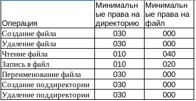

---
## Front matter
lang: ru-RU
title: Лабораторная работа No 3.
author:
  - Тагиев Б. А.
institute:
  - Российский университет дружбы народов, Москва, Россия
date: 23 сентября 2023

## i18n babel
babel-lang: russian
babel-otherlangs: english

## Formatting pdf
toc: false
toc-title: Содержание
slide_level: 2
aspectratio: 169
theme: metropolis
section-titles: true
header-includes:
 - \metroset{progressbar=frametitle,sectionpage=progressbar,numbering=fraction}
 - '\makeatletter'
 - '\beamer@ignorenonframefalse'
 - '\makeatother'
---

## Цель работы

Получение практических навыков работы в консоли с атрибутами файлов для групп пользователей.

# Выполнение лабораторной работы

## Настройка пользователей, групп и папок

1. Создать пользователя guest, guest2. Добавить guest2 в группу guest. 

{#fig:001 width=50%}

## Настройка пользователей, групп и папок

2. Зайти в сессии данных пользователей и посмотреть вывод команды `pwd`.

{#fig:002 width=50%}

## Настройка пользователей, групп и папок

3. Проверим идентификаторы групп. Значения из `id` совпадают с `groups`.

{#fig:003 width=40%}

{#fig:004 width=40%}

## Настройка пользователей, групп и папок

4. В файле `/etc/group` можем наблюдать GID наших групп.

{#fig:005 width=50%}

## Настройка пользователей, групп и папок

5. Обнулим права на `/home/guest/dir1` и выдадим группе `guest` права 7 на "хомяка" пользователя.

{#fig:006 width=50%}

# Установленные права и разрешённые действия для групп

## Таблица с правами

{#fig:007} 

## Таблица с правами

{#fig:008} 

## Таблица с правами

{#fig:009} 

## Таблица с правами

{#fig:010} 

## Таблица с правами

{#fig:011} 

## Таблица с правами

{#fig:012} 

## Таблица с правами

{#fig:013} 

## Таблица с правами

{#fig:014} 

# Минимальные права для совершения операций от имени пользователей входящих в группу

## Таблица с правами

{#fig:015} 

## Выводы

По итогам выполнения работы, я приобрел навыки работы в консоли с атрибутами файлов для групп пользователей.
