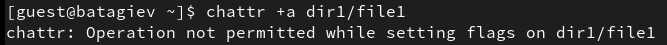

---
## Front matter
lang: ru-RU
title: Лабораторная работа No 4.
author:
  - Тагиев Б. А.
institute:
  - Российский университет дружбы народов, Москва, Россия
date: 29 сентября 2023

## i18n babel
babel-lang: russian
babel-otherlangs: english

## Formatting pdf
toc: false
toc-title: Содержание
slide_level: 2
aspectratio: 169
theme: metropolis
section-titles: true
header-includes:
 - \metroset{progressbar=frametitle,sectionpage=progressbar,numbering=fraction}
 - '\makeatletter'
 - '\beamer@ignorenonframefalse'
 - '\makeatother'
---

## Цель работы

Получение практических навыков работы в консоли с расширенными атрибутами файлов.

## Выполнение лабораторной работы

1. От имени пользователя `guest` определим расширенные атрибуты файла `/home/guest/dir1/file1`.

{#fig:001} 
 
## Выполнение лабораторной работы

2. Установим на файл `file1` права, разрешающие чтение и запись для владельца файла.

{#fig:002} 

## Выполнение лабораторной работы

3. Попробуем добавить расширенный атрибут `a` от имени `guest`.

{#fig:003} 

## Выполнение лабораторной работы

4. Зайдем под рута и повторим предыдущее действие. Проверим правильность установленных атрибутов.

{#fig:004} 

## Выполнение лабораторной работы

5. Выполним дозапись в `dir1/file1`.

{#fig:005} 

## Выполнение лабораторной работы

6. Сотрем текущую информацию из файла `dir1/file1`. Также, попробуем переименовать файл.

{#fig:006} 

## Выполнение лабораторной работы

7. Попробуем изменить права доступа к файлу.

{#fig:007} 

## Выполнение лабораторной работы

8. Снимим атрибут `a` и повторно запустим те действия, которые приводили к ошибке.

{#fig:008} 

## Выводы

В результате выполнения работы я повысил свои навыки использования интерфейса командой строки (CLI), познакомился на примерах с тем, как используются основные и расширенные атрибуты при разграничении доступа. Имел возможность связать теорию дискреционного разделения доступа (дискреционная политика безопасности) с её реализацией на практике в ОС Linux. Составил наглядные таблицы, поясняющие какие операции возможны при тех или иных установленных правах. Опробовал действие на практике расширенных атрибутов «а» и «i».
