---
## Front matter
lang: ru-RU
title: Лабораторная работа No 5.
author:
  - Тагиев Б. А.
institute:
  - Российский университет дружбы народов, Москва, Россия
date: 7 октября 2023

## i18n babel
babel-lang: russian
babel-otherlangs: english

## Formatting pdf
toc: false
toc-title: Содержание
slide_level: 2
aspectratio: 169
theme: metropolis
section-titles: true
header-includes:
 - \metroset{progressbar=frametitle,sectionpage=progressbar,numbering=fraction}
 - '\makeatletter'
 - '\beamer@ignorenonframefalse'
 - '\makeatother'
---

## Цель работы

Изучение механизмов изменения идентификаторов, применения SetUID- и Sticky-битов. Получение практических навыков работы в консоли с дополнительными атрибутами. Рассмотрение работы механизма смены идентификатора процессов пользователей, а также влияние бита Sticky на запись и удаление файлов.

# Выполнение лабораторной работы

## SetUID бит

1. Из-под пользователя `guest` создадим файл `simpleid.c`

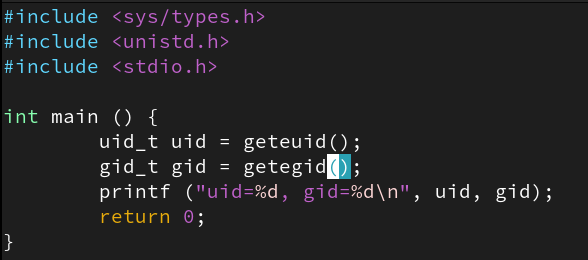{#fig:001} 

## SetUID бит

2. Скомпилируем, запустим и сравним результат с выводом команды `id`. User ID и Group ID совпадают.

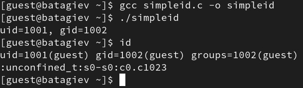{#fig:002} 

## SetUID бит

3. Перепишем программу, чтобы она возвращала нам `e_uid`/`e_gid` и действительный `uid`/`gid`. `getgid` возвращает действительный идентификатор группы текущего процесса. `getegid` возвращает эффективный идентификатор группы текущего процесса. Действительный идентификатор соответствует идентификатору вызывающего процесса. Эффективный идентификатор соответствует биту `setuid` на исполняемом файле.   

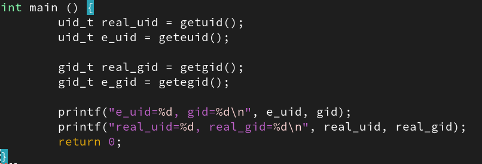{#fig:003 width=50%} 

## SetUID бит

4. Поменяем пользователя-обладателя исполняемого файла и добавить бит `setuid`.

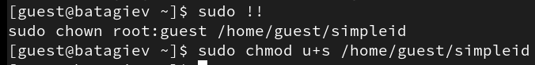{#fig:005} 

## SetUID бит

5. Проверим изменения.

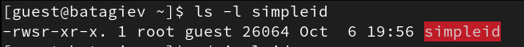{#fig:006} 

## SetUID бит

6. Запустим исполняемый файл.

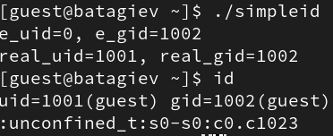{#fig:007} 

## SetUID бит

7. Проведем те же манипуляции над файлов, но теперь для группы.

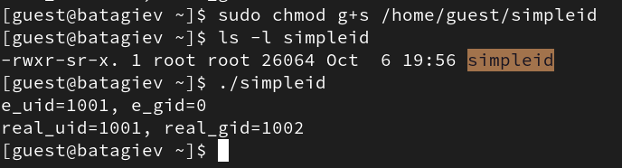{#fig:008} 

## SetUID бит

8. Создадим программу `readfile.c`

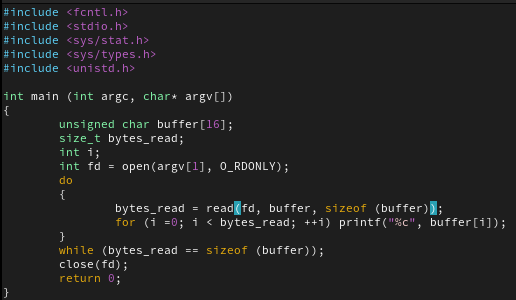{#fig:009} 

## SetUID бит

9. Изменим права для файла `readfile.c`. Проверим изменения.

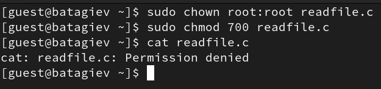{#fig:010} 

## SetUID бит

10. Сменим владельца файла `readfile`, а также добавим `setuid` бит.

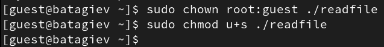{#fig:011} 

## SetUID бит

11. Проверим чтения разных файлов. Например `readfile.c` и `/etc/shadow`.

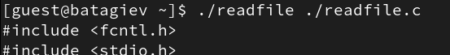{#fig:012} 

## SetUID бит

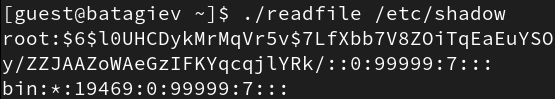{#fig:013} 

## Sticky бит

1. Проверим установлен ли атрибут Sticky на директорию `/tmp`.

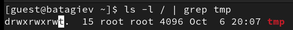{#fig:014} 

## Sticky бит

2. Создадим файл `/tmp/file01.txt`. Добавим для остальных пользователей права на чтение и запись.

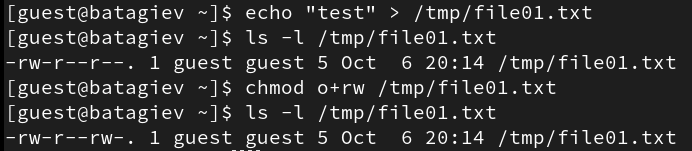{#fig:015} 

## Sticky бит

3. Попробуем прочитать содержимое файла от пользователя `guest2`.

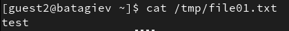{#fig:016} 

## Sticky бит

4. Допишем в конец файла новый текст.

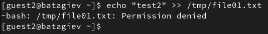{#fig:017} 

## Sticky бит

5. А также удалим этот файл.

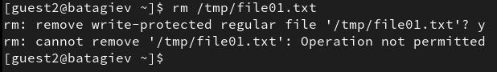{#fig:018} 

## Sticky бит

6. Удалим sticky бит директории `/tmp`.

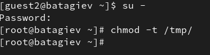{#fig:019} 

## Sticky бит

7. Повторим предыдущие действия по изменению файла.

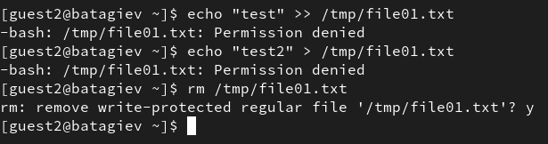{#fig:021} 

## Выводы

В результате выполнения работы я выполнил цели работы.
