---
## Front matter
title: "Лабораторная работа No 5."
author: "Тагиев Байрам Алтай оглы"

## Generic otions
lang: ru-RU
toc-title: "Содержание"

## Bibliography
bibliography: bib/cite.bib
csl: pandoc/csl/gost-r-7-0-5-2008-numeric.csl

## Pdf output format
toc: true # Table of contents
toc-depth: 2
lof: true # List of figures
lot: true # List of tables
fontsize: 12pt
linestretch: 1.5
papersize: a4
documentclass: scrreprt
## I18n polyglossia
polyglossia-lang:
  name: russian
  options:
	- spelling=modern
	- babelshorthands=true
polyglossia-otherlangs:
  name: english
## I18n babel
babel-lang: russian
babel-otherlangs: english
## Fonts
mainfont: PT Serif
romanfont: PT Serif
sansfont: PT Sans
monofont: PT Mono
mainfontoptions: Ligatures=TeX
romanfontoptions: Ligatures=TeX
sansfontoptions: Ligatures=TeX,Scale=MatchLowercase
monofontoptions: Scale=MatchLowercase,Scale=0.9
## Biblatex
biblatex: true
biblio-style: "gost-numeric"
biblatexoptions:
  - parentracker=true
  - backend=biber
  - hyperref=auto
  - language=auto
  - autolang=other*
  - citestyle=gost-numeric
## Pandoc-crossref LaTeX customization
figureTitle: "Рис."
tableTitle: "Таблица"
listingTitle: "Листинг"
lofTitle: "Список иллюстраций"
lotTitle: "Список таблиц"
lolTitle: "Листинги"
## Misc options
indent: true
header-includes:
  - \usepackage{indentfirst}
  - \usepackage{float} # keep figures where there are in the text
  - \floatplacement{figure}{H} # keep figures where there are in the text
---

# Цель работы

Изучение механизмов изменения идентификаторов, применения SetUID- и Sticky-битов. Получение практических навыков работы в консоли с дополнительными атрибутами. Рассмотрение работы механизма смены идентификатора процессов пользователей, а также влияние бита Sticky на запись и удаление файлов.

# Выполнение лабораторной работы

## SetUID бит

1. Из-под пользователя `guest` создадим файл `simpleid.c`

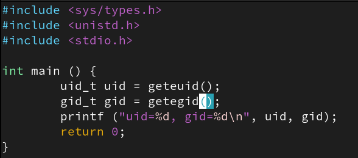{#fig:001} 

2. Скомпилируем, запустим и сравним результат с выводом команды `id`. User ID и Group ID совпадают.

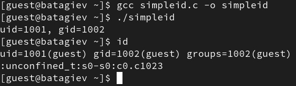{#fig:002} 

3. Перепишем программу, чтобы она возвращала нам `e_uid`/`e_gid` и действительный `uid`/`gid`. `getgid` возвращает действительный идентификатор группы текущего процесса. `getegid` возвращает эффективный идентификатор группы текущего процесса. Действительный идентификатор соответствует идентификатору вызывающего процесса. Эффективный идентификатор соответствует биту `setuid` на исполняемом файле.   

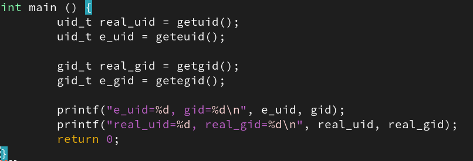{#fig:003} 

4. Поменяем пользователя-обладателя исполняемого файла и добавить бит `setuid`.

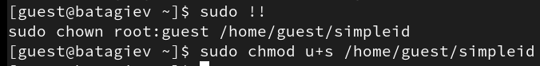{#fig:005} 

5. Проверим изменения.

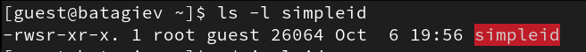{#fig:006} 

6. Запустим исполняемый файл.

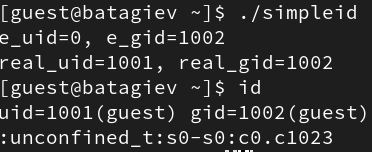{#fig:007} 

7. Проведем те же манипуляции над файлов, но теперь для группы.

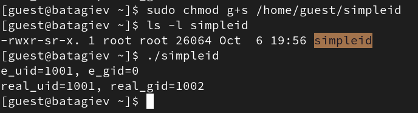{#fig:008} 

8. Создадим программу `readfile.c`

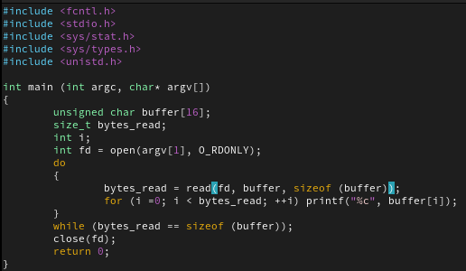{#fig:009} 

9. Изменим права для файла `readfile.c`. Проверим изменения.

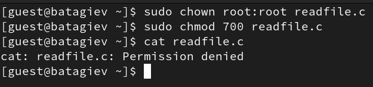{#fig:010} 

10. Сменим владельца файла `readfile`, а также добавим `setuid` бит.

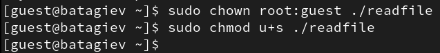{#fig:011} 

11. Проверим чтения разных файлов. Например `readfile.c` и `/etc/shadow`.

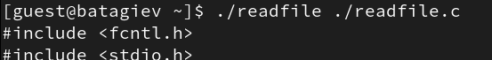{#fig:012} 

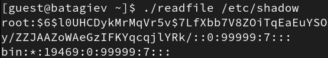{#fig:013} 

## Sticky бит

1. Проверим установлен ли атрибут Sticky на директорию `/tmp`.

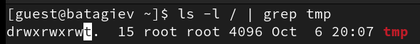{#fig:014} 

2. Создадим файл `/tmp/file01.txt`. Добавим для остальных пользователей права на чтение и запись.

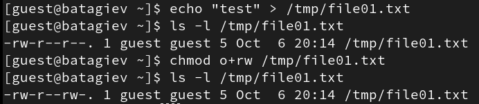{#fig:015} 

3. Попробуем прочитать содержимое файла от пользователя `guest2`.

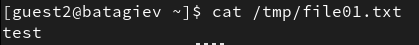{#fig:016} 

4. Допишем в конец файла новый текст.

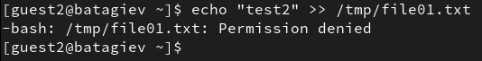{#fig:017} 

5. А также удалим этот файл.

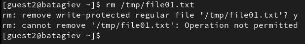{#fig:018} 

6. Удалим sticky бит директории `/tmp`.

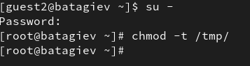{#fig:019} 

7. Повторим предыдущие действия по изменению файла.

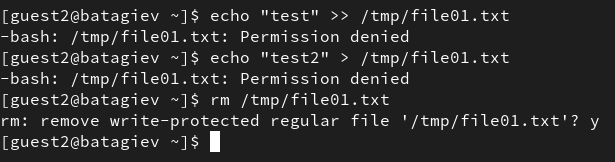{#fig:021} 

# Выводы

В результате выполнения работы я выполнил цели работы.
