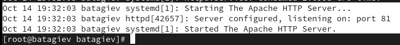

---
## Front matter
lang: ru-RU
title: Лабораторная работа No 6.
author:
  - Тагиев Б. А.
institute:
  - Российский университет дружбы народов, Москва, Россия
date: 14 октября 2023

## i18n babel
babel-lang: russian
babel-otherlangs: english

## Formatting pdf
toc: false
toc-title: Содержание
slide_level: 2
aspectratio: 169
theme: metropolis
section-titles: true
header-includes:
 - \metroset{progressbar=frametitle,sectionpage=progressbar,numbering=fraction}
 - '\makeatletter'
 - '\beamer@ignorenonframefalse'
 - '\makeatother'
---

## Цель работы

Развить навыки администрирования ОС Linux. Получить первое практическое знакомство с технологией SELinux.

# Выполнение лабораторной работы

## Подготовка лабораторного стенда

1. Установить `Apache2` при помощи `dnf`.

```
dnf install httpd
```

## Подготовка лабораторного стенда

2. В конфигурационном файле httpd.conf прописать параметр ServerName.

{#fig:001}

## Подготовка лабораторного стенда

3. Отключить пакетный фильтр при помощи `iptables`.

{#fig:002} 

## Выполнение

1. Проверим правильность работы SELinux. Должен быть выставлен режим enforcing политики targeted.

{#fig:003} 

## Выполнение

2. Запустим Apache веб-сервер.

{#fig:004} 

## Выполнение

3. В списке процессов найдем httpd.

{#fig:005} 

## Выполнение

:::::::::::::: {.columns align=center}
::: {.column width="70%"}

{#fig:006} 

:::
::: {.column width="30%"}

4. Посмотрим текущее состояние переключателей SELinux для Apache2.

:::
::::::::::::::


## Выполнение

:::::::::::::: {.columns align=center}
::: {.column width="30%"}

5. Также посмотрим текущую статистику по политике.

:::
::: {.column width="70%"}

{#fig:007} 

:::
::::::::::::::


## Выполнение

6. Посмотрим текущий контекст безопасности для файлов и поддиректорий в директории `/var/www`.

 - Установлен контекст `httpd_sys_script_exec_t` для cgi-скриптов, чтобы был разрешен им доступ ко всем sys-типам.

 - Установлен контекст `httpd_sys_content_t` для содержимого, которое должно быть доступно для всех скриптов httpd и для самого демона.

## Выполнение

{#fig:008} 

## Выполнение

7. В директории `/var/www/html` пусто.

{#fig:009} 

## Выполнение

8. В директории `/var/www/html` создавать папки может только root.

## Выполнение

9. Создадим файл `/var/www/html/test.html`.

{#fig:010} 

## Выполнение

10. Проверим контекст созданного нами файла.

{#fig:011} 

## Выполнение

11. Перейдем в браузер и в нем проверим доступность данного файла.

{#fig:012} 

## Выполнение

12. Изменим конекст файла, чтобы Apache не смог получить доступ.

{#fig:013} 

## Выполнение

13. Проверим, что доступ к файлу стал не доступен.

{#fig:014} 

## Выполнение

14. Посмотрим логи от веб-сервера Apache.

{#fig:015} 

## Выполнение

Также проверим audit.log.

{#fig:0151} 

## Выполнение

15. Поменяем порт, на котором работает Apache.

{#fig:016} 

## Выполнение

16. Перезапустим веб-сервер.

{#fig:017} 

## Выполнение

17. В логах наблюдаем запуск сервера на 81 порту.

{#fig:018} 

## Выполнение

18. Добавим порт в `semanage` для `http_port_t` и проверим его добавление

{#fig:019} 

{#fig:0191} 

## Выполнение

19. Ввернем контекст файлу `test.html`.

20. Удалим привязку порта.

21. Удалим файл `test.html`.

## Выводы

В результате выполнения работы я выполнил цели работы.
