---
## Front matter
title: "Лабораторная работа No 6."
author: "Тагиев Байрам Алтай оглы"

## Generic otions
lang: ru-RU
toc-title: "Содержание"

## Bibliography
bibliography: bib/cite.bib
csl: pandoc/csl/gost-r-7-0-5-2008-numeric.csl

## Pdf output format
toc: true # Table of contents
toc-depth: 2
lof: true # List of figures
lot: true # List of tables
fontsize: 12pt
linestretch: 1.5
papersize: a4
documentclass: scrreprt
## I18n polyglossia
polyglossia-lang:
  name: russian
  options:
	- spelling=modern
	- babelshorthands=true
polyglossia-otherlangs:
  name: english
## I18n babel
babel-lang: russian
babel-otherlangs: english
## Fonts
mainfont: PT Serif
romanfont: PT Serif
sansfont: PT Sans
monofont: PT Mono
mainfontoptions: Ligatures=TeX
romanfontoptions: Ligatures=TeX
sansfontoptions: Ligatures=TeX,Scale=MatchLowercase
monofontoptions: Scale=MatchLowercase,Scale=0.9
## Biblatex
biblatex: true
biblio-style: "gost-numeric"
biblatexoptions:
  - parentracker=true
  - backend=biber
  - hyperref=auto
  - language=auto
  - autolang=other*
  - citestyle=gost-numeric
## Pandoc-crossref LaTeX customization
figureTitle: "Рис."
tableTitle: "Таблица"
listingTitle: "Листинг"
lofTitle: "Список иллюстраций"
lotTitle: "Список таблиц"
lolTitle: "Листинги"
## Misc options
indent: true
header-includes:
  - \usepackage{indentfirst}
  - \usepackage{float} # keep figures where there are in the text
  - \floatplacement{figure}{H} # keep figures where there are in the text
---

# Цель работы

Развить навыки администрирования ОС Linux. Получить первое практическое знакомство с технологией SELinux.

# Выполнение лабораторной работы

## Подготовка лабораторного стенда

1. Установить `Apache2` при помощи `dnf`.

```
dnf install httpd
```

2. В конфигурационном файле httpd.conf прописать параметр ServerName (@fig:001).

{#fig:001}

3. Отключить пакетный фильтр при помощи `iptables` (@fig:002).

{#fig:002} 

## Выполнение

1. Проверим правильность работы SELinux. Должен быть выставлен режим enforcing политики targeted (@fig:003).

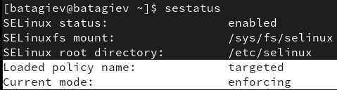{#fig:003} 

2. Запустим Apache веб-сервер (@fig:004).

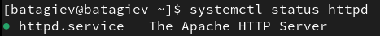{#fig:004} 

3. В списке процессов найдем httpd (@fig:005). На этот процесс выставлен следующий контекст безопасности (первый столбец изображения @gentooSELinuxTutorialsLinuxServices).

{#fig:005} 

4. Посмотрим текущее состояние переключателей SELinux для Apache2 (@fig:006).

{#fig:006} 

5. Также посмотрим текущую статистику по политике (@fig:007).

{#fig:007} 

6. Посмотрим текущий контекст безопасности для файлов и поддиректорий в директории `/var/www` (@fig:008).

 - Установлен контекст `httpd_sys_script_exec_t` для cgi-скриптов, чтобы был разрешен им доступ ко всем sys-типам.

 - Установлен контекст `httpd_sys_content_t` для содержимого, которое должно быть доступно для всех скриптов httpd и для самого демона.

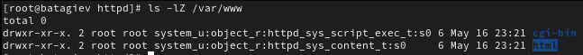{#fig:008} 

7. В директории `/var/www/html` пусто.

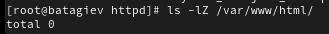{#fig:009} 

8. В директории `/var/www/html` создавать папки может только root (право w есть только у него).

9. Создадим файл `/var/www/html/test.html` (@fig:010).

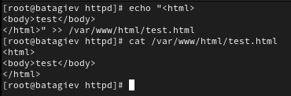{#fig:010} 

10. Проверим контекст созданного нами файла (@fig:011).

{#fig:011} 

11. Перейдем в браузер и в нем проверим доступность данного файла (@fig:012).

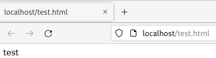{#fig:012} 

12. Изменим конекст файла, чтобы Apache не смог получить доступ (@fig:013).

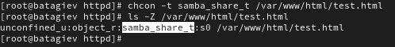{#fig:013} 

13. Проверим, что доступ к файлу стал не доступен (@fig:014).

{#fig:014} 

14. Посмотрим логи от веб-сервера Apache (@fig:015).

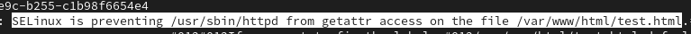{#fig:015} 

Также проверим audit.log (@fig:0151).

{#fig:0151} 

15. Поменяем порт, на котором работает Apache.

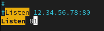{#fig:016} 

16. Перезапустим веб-сервер (успешно).

{#fig:017} 

17. В логах наблюдаем запуск сервера на 81 порту.

{#fig:018} 

18. Добавим порт в `semanage` для `http_port_t` и проверим его добавление

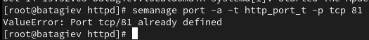{#fig:019} 

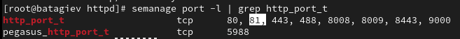{#fig:0191} 

19. Ввернем контекст файлу `test.html`.

20. Удалим привязку порта.

21. Удалим файл `test.html`.

# Выводы

В результате выполнения работы я выполнил цели работы.
